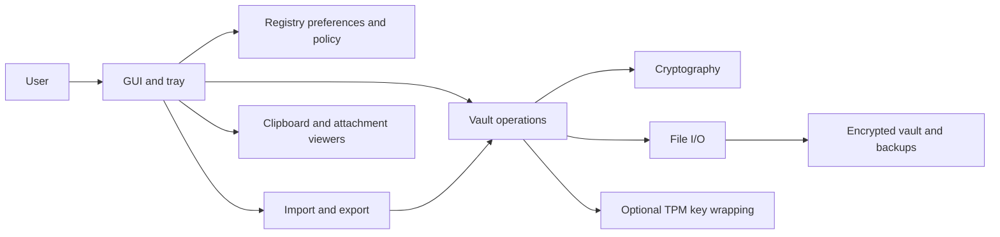
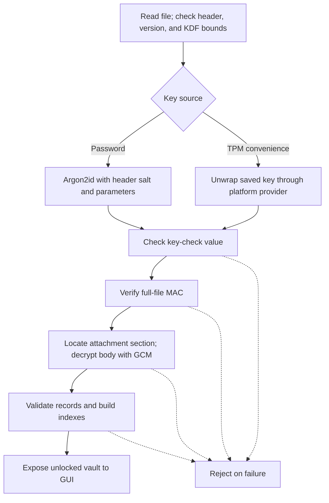
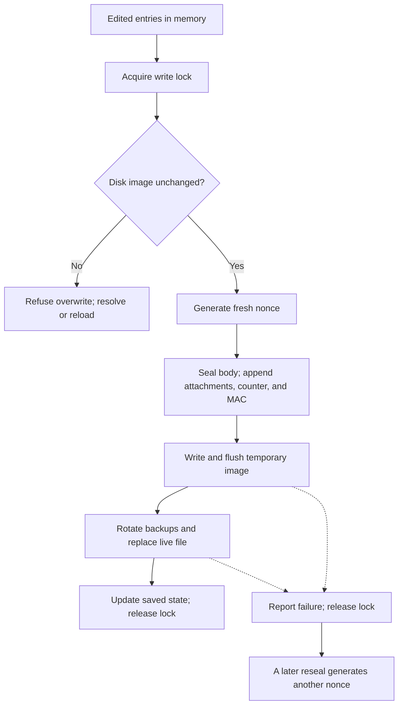

# Architecture

[Documentation](README.md) · [Risk assessment](RISK_ASSESSMENT.md) · [Format reference](formats.md) · [Assurance](ASSURANCE.md)

## System overview

Vordr is a native Win64 application with one active vault context. Most user
interaction lives in `gui.asm`; `vault.asm` owns the encrypted container and
record operations. Import and export temporarily use additional contexts and
must restore the active vault's key, body, and path on every exit.

The last branch is an exposure boundary: clipboard contents and preview files
are plaintext. Registry settings are outside the vault; TPM blobs and rollback
history are also stored there. The application contains no network client.
Opening a URL or preview launches another application, which may use the network.

## Unlock

The parser must inspect enough unauthenticated header data to choose and bound
the KDF parameters. Bounds checks happen before expensive derivation, but the
allowed maximum can still be costly. Authentication follows key recovery.

The complete 80-byte header is GCM associated data. The mandatory file MAC
covers the encrypted body, attachment section, and save counter. A version-2
file without a valid trailer is rejected; version 1 is not accepted by this reader.

## Save and retry

`vault_reseal` checks read-only state, acquires an advisory `<vault>.lock`,
and checks whether the on-disk file changed since it was loaded. It generates
a new 12-byte random body nonce before calling the writer.

The GUI's edit transaction retains the original body and history until saving
succeeds. A failed save restores the original model while retaining the edit
form for retry. Internal file-write retries operate on the already-constructed
ciphertext; a new reseal draws a new nonce.

Temporary writes and replacement reduce partial-write risk. They cannot promise
durability against every filesystem, storage device, power failure, or sync
conflict. Nearby rotating backups are not an independent backup.

## Cryptographic components

| Purpose | Implementation |
|---|---|
| Password derivation | Argon2id; default t=3, m=524288 KiB, p=1 |
| Vault body and attachments | AES-256-GCM with 96-bit nonces |
| Key-check value | First 16 bytes of SHA-256 of the vault key |
| Full-file authentication | BLAKE2b-256 over a domain prefix, vault key, and file image through the counter |
| TOTP | HMAC-SHA-1, base32 keys, HOTP/TOTP |
| ZIP interoperability | WinZip AE-2: PBKDF2-HMAC-SHA1, AES-256-CTR, truncated HMAC-SHA1 |
| Randomness | `BCryptGenRandom`, supplemented by RDSEED when available |
| TPM convenience | RSA-OAEP with SHA-256 through Microsoft Platform Crypto Provider; RSA-2048 requested |

These are in-repository implementations of published primitives. That does not
make their composition or implementation automatically secure. In particular,
the file MAC uses an explicit prefix construction, not BLAKE2's native keyed mode;
see [the exact format](formats.md#file-authentication-trailer).

The TPM key-length property request is best-effort, and existing keys are reused
without a length check. Provider UI policy is also best-effort. The
[risk assessment](RISK_ASSESSMENT.md#r5--unintended-access-through-tpm-convenience-unlock)
explains why neither should be treated as a stronger enforcement guarantee.

Random generation fails if the OS RNG fails. RDSEED is optional, can run out of
retries, and only mixes complete eight-byte lanes; the OS output remains the
primary random source. Random nonces have a nonzero collision probability.
The save counter is for rollback detection, not nonce generation.

New attachments get independent random keys and nonces. Existing attachment
ciphertext can be copied unchanged into a new image or native export. A pending
attachment is re-encrypted from the same staged bytes; changed content is staged
with fresh encryption metadata.

ZIP password derivation uses 1,000 iterations, substantially less costly than
the native vault KDF. This is an interoperability trade-off, not an equivalent
backup format. See the [WinZip specification](https://www.winzip.com/en/support/aes-encryption/).

## Security boundaries

| Boundary | Control | Limit |
|---|---|---|
| Stolen vault file | Password derivation and authenticated encryption | Weak passwords can still be guessed offline |
| Untrusted file contents | Length/cost caps and authentication before record use | Parsers and crypto remain security-critical code |
| Concurrent saves | Advisory lock and changed-image check | Sync clients and non-cooperating writers need not honor the lock |
| Older intact vault | Counter compared with local HKCU history | No trusted global monotonic counter |
| Unlocked process memory | Selected locked buffers, wiping, runtime checks | Not all scratch is locked; no hostile-OS guarantee |
| Password entry | Optional private desktop | Normal-prompt fallback and privileged observation remain possible |
| Convenience unlock | TPM wrapping; optional provider UI policy | An alternative unlock route, not a second factor; provider UI policy is best-effort |
| Clipboard and previews | Time limits, exclusion flags, tracked cleanup | Other applications may copy or retain plaintext |

Avoid calling the whole application “quantum-proof.” The native vault uses
symmetric cryptography, while the optional TPM path uses RSA. A hardware-bound
private key does not turn RSA into a post-quantum algorithm.

## Runtime hardening

Shared macros provide stack canaries, software shadow-stack checks, guarded
indirect-call landing pads, checked arithmetic, and bounds/type checks. Heap
allocations carry canaries and tags. The import table is made read-only after
startup. Link flags enable ASLR, DEP/NX, high-entropy address space, and CET
compatibility where supported.

These checks detect particular misuse patterns; they do not make assembly
memory-safe. Windows CFG (`/guard:cf`) is deliberately not enabled because the
build lacks the required MASM callback metadata. The software landing-pad guard
must not be described as Windows CFG.

## Source map

| Files under `src/` | Responsibility |
|---|---|
| `main.asm`, `gui.asm` | CPU/startup gates, CLI dispatch, windows, dialogs, tray |
| `macros.inc` | Shared constants, structures, and calling/hardening macros |
| `hardening.asm`, `loadcfg.asm` | Runtime checks, heap, exception handling, PE load configuration |
| `secmem.asm` | Locked secret allocations, tracked frees, selected panic wipes |
| `random.asm` | OS RNG and optional hardware mixing |
| `sha256.asm`, `sha1.asm`, `aesgcm.asm`, `blake2b.asm`, `argon2.asm` | Cryptographic primitives |
| `vault.asm` | Container parsing/writing, records, attachments, native import/export |
| `totp.asm`, `pwgen.asm` | One-time codes, password generation and policy |
| `tpm.asm`, `regcfg.asm` | TPM wrapping, registry precedence, paths, rollback history |
| `zipexport.asm`, `zipimport.asm` | AES ZIP and JSON interoperability |
| `theme.asm` | Color schemes and painting |
| `fileio.asm`, `console.asm`, `log.asm` | File access, diagnostic output, logging |
| `selftest.asm`, `redteam.asm`, `bench.asm` | Self-tests, fault injection, benchmarks |

See [settings ownership](SETTINGS_DESIGN.md) and
[system-item indexing](SYSITEM_DESIGN.md) before modifying those paths.
