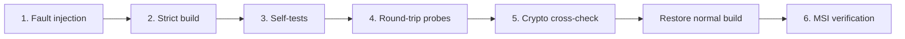

# Assurance and verification

[Documentation](README.md) · [Visual guide](assurance.html) · [Secret memory](SECRETS.md)

This guide maps claims to tests and explains their limits. It is not a
certification, a live CI dashboard, or a claim that every possible input is safe.
No independent external security review is recorded in the repository.

Read the [risk assessment](RISK_ASSESSMENT.md) for the overall security judgment,
threat scenarios, and residual risks. This guide supplies the test evidence;
it is not a substitute for that assessment.

## Reproduce the checks

Use Windows with the x64 MSVC/SDK toolchain and Python 3 on PATH. Read the
[test-safety warning](DEVELOPMENT.md#full-test-gate-read-before-running) first:
the full driver stops running Vordr processes and replaces build outputs.

```bat
tests\run_all.cmd
```

For crypto checks against an existing executable:

```bat
python tests\verify_crypto.py --exe bin\vordr.exe
```

Record the commit, toolchain, command, exit status, and complete logs. Do not copy
an old count of passing tests into a claim about a new revision.

## The six-stage gate



| Stage | Evidence produced | Important limit |
|---|---|---|
| Fault injection | Deliberate canary, shadow-stack, indirect-call, arithmetic, bounds, type, heap-tag, and IAT violations terminate the test process | Checks termination behavior, not all paths; the driver accepts a fail-fast code family for most cases rather than matching every exact reason |
| Strict build | Eight Python source checkers plus assembly/resource/link success | Python absence skips source checks; pattern-based checkers have blind spots |
| Self-tests | Known-answer checks pass; normal release rejects diagnostic file-writing verbs in the following stage | Fixed vectors exercise selected cases |
| Round-trip | Serialization, imports/exports, attachments, policy, locking, parsers, preview cleanup, and persistence probes | Synthetic and bounded input space; geometry may skip without a desktop |
| Crypto differential | Output compared with independent Python calculations and published vectors | Functional output checks, not a side-channel proof |
| Installer | MSI tables and component costing checked | Does not install, upgrade, or uninstall the program |

`--quick` skips fault injection. Missing Python can skip crypto/persistence
checks; missing `makecab` can skip the installer stage. The final banner treats
allowed skips as success. A release review must explicitly inspect them.

## Cryptographic checks

`katreport` emits deterministic outputs for public inputs. The verifier uses
Python's `hashlib`, `hmac`, and base32 support, plus an in-file AES-GCM
reference that first checks itself against a fixed GCM vector.

| Primitive | Independent comparison or vector source |
|---|---|
| SHA-256 | Python hashlib; published “abc” digest and block-boundary inputs |
| BLAKE2b | Python hashlib; RFC 7693 digest and block-boundary inputs |
| HMAC-SHA1 | Python hmac; RFC 2202 cases |
| AES-256-GCM | In-file Python implementation; fixed GCM vectors, AAD, partial and empty plaintext |
| Argon2id | RFC 9106 §5.3 vector; embedded implementation also carries additional conformance cases |
| HOTP/TOTP | HMAC-based recomputation; RFC 4226 HOTP values and time-step inputs |
| Base32 | Python base64 implementation |

The Python harness has no independent Argon2 implementation. Its Argon2 check
is a published-vector comparison, not a second full implementation. Startup
self-tests provide another check, but share the shipped implementation.

A correct output on these inputs does not establish general correctness or
constant-time behavior. `cttest` is a debug timing probe, not a gate-level
side-channel guarantee. For negative controls, use a disposable checkout to
alter an expected result and confirm the verifier reports a mismatch; it does
not expose a command-line option for reading an edited report file.

## Static checks

| Checker under `tools/` | Detects |
|---|---|
| `framecheck.py` | Stack/frame and call-argument layout problems |
| `idcheck.py` | Resource/assembly control-ID drift and collisions |
| `constcheck.py` | Inconsistent constants between modules |
| `dlgtarget.py` | Controls addressed through the wrong known dialog, including settings-table ownership |
| `deadcode.py` | Apparently unreferenced symbols |
| `rccheck.py` | Resource-template geometry problems |
| `wstrcheck.py` | Bounded string-copy calls missing their bound |
| `aligncheck.py` | Misaligned wide-string declarations |

These are source-pattern checks, not a complete compiler or program proof.
A refactor can reduce what a checker recognizes without introducing a reported
failure. Inspect coverage and unknown cases when changing the patterns it scans.

## Regression map

The executable commands and their arguments are defined by
[the test driver](../tests/run_all.cmd); some intentionally return a count
rather than the conventional zero-on-success result.

| Area | Relevant probes |
|---|---|
| Secret cleanup and allocation | `secscan`, `secfreedup`, `lktest`, `tmptest` |
| Input parsing and bounds | `vfuzz`, `fuzzzip`, `jfuzz`, `attfuzz`, `kdfparam`, `convcap` |
| Save integrity and concurrency | `bktest`, `mactest`, `rbtest`, `xctest`, `reload`, `cowrite` |
| Native exchange and metadata | `sysitemkat`, `vexselkat`, `c9kat`, `vimpkat`, `vaultexportkat`, `vaultexpattkat` |
| ZIP export | `atgen`, `zitest`, `zexcap`, `zexname` |
| GUI geometry and failed-edit retry | `layoutkat` |
| Long-path context restoration | `tests/verify_persistence.py` |

`secscan` checks its planted sentinel after a selected wipe path. It does not
inventory every possible plaintext copy, prove pagefile/hibernation exclusion,
or guarantee cleanup after arbitrary process termination.

The secure allocator tracks currently live base addresses. This prevents
repeated frees of an address that is no longer registered; it is not a general
solution to stale pointers if an address has since been reused.

## Historical regression context

Earlier documentation described the following bugs and their regression tests.
This list preserves that engineering context; it does not establish affected
release ranges or replace a security advisory.

| Prior failure mode | Regression or control |
|---|---|
| ZIP central-directory array overflow | `zexcap` capacity guard |
| Unbounded pre-authentication KDF costs | `vk_params_ok`, `kdfparam` |
| JSON parse cursor not advancing | Forward-progress checks, `jfuzz` |
| Unbounded attachment-filename conversion | Bounded conversion and export tests |
| Attachment-length arithmetic wrap | Validate before arithmetic in vault open |
| Repeated secure-buffer free during context teardown | Live allocation registry, `secfreedup` |
| Failed GUI save losing the editable transaction | Original-body/history restoration, `layoutkat` |
| Preview cleanup forgotten while a viewer held the file | Retained cleanup tracking, `tmptest` |
| Long vault paths truncated during temporary context switches | `verify_persistence.py` |

Use [release records](RELEASES.md) and [the security policy](../SECURITY.md)
for release-specific disclosure. Neither this table nor a passing test suite
should be interpreted as a “clean bill of security.”

## Checks that still require a person

- Inspect GUI layout, focus, keyboard operation, private-desktop fallback, and
  lock/unlock transitions on supported machines.
- Test real MSI upgrade and uninstall behavior in an isolated environment.
- Verify backup restoration and conflict behavior on the intended storage.
- Evaluate attacker reachability, crypto composition, and side channels.
- Rebuild the exact release with a matching toolchain and compare its bytes.
