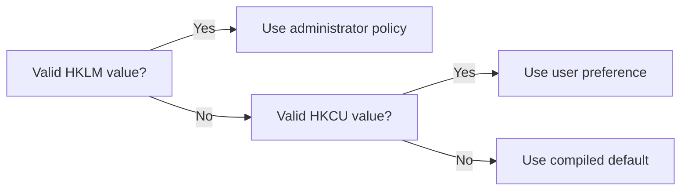

# Deployment and policy

[Documentation](README.md) · [User guide](USER_GUIDE.md) · [Release checklist](RELEASE_CHECKLIST.md)

This guide is for administrators installing Vordr or enforcing settings.
A portable installation does not require machine policy.

## Installation and upgrades

The MSI installs for all users in `%ProgramFiles%\Vordr`. It can register an
all-users Start Menu shortcut, the `.vordr` file association, and only the policy
values explicitly supplied at installation. Installation requires elevation;
the application manifest uses `asInvoker`, so running Vordr does not itself
request elevation.

Run these Command Prompt examples in an elevated shell, replacing the filename
with the package being deployed:

```bat
msiexec /i vordr-0.2.3.msi /qn
msiexec /i vordr-0.2.3.msi /qn VORDR_SECUREUNLOCK=1 VORDR_PWMINLEN=16
msiexec /x vordr-0.2.3.msi /qn
```

The package replaces related versions from 0.0.0 through its own version,
inclusive. A rebuilt package of the same version should replace, not install
alongside, the previous package. The UpgradeCode must stay stable.

**Repeat policy properties on upgrades.** MSI properties are not remembered as
deployment configuration. Removing the previous package can remove its policy
values; an upgrade without those properties does not automatically restore them.

Uninstall removes the executable, shortcut, association registrations it owns,
and installer-owned policy values. It does not remove vaults or HKCU user data.
Do not add broad `RemoveFile` cleanup to the package.

## How policy is resolved

For supported configuration values, Vordr checks the 64-bit registry view in
this order:



Policy is under `HKLM\SOFTWARE\Vordr`, not `SOFTWARE\Policies`.
Preferences are under `HKCU\SOFTWARE\Vordr`.

A valid HKLM value's **presence** enforces the supported setting and disables
its matching Settings control. Writing the default is therefore different from
leaving the value absent. The save path skips locked settings. To restore user
choice, remove the policy value instead of writing its default.

The vault path and hotkey have special handling described below; do not assume
every registry value has an MSI property or a visible policy-lock indicator.

## Properties

Fourteen public MSI properties map to DWORD settings. Defaults apply only when
no valid setting exists; the installer does not write defaults automatically.

| Property | Registry value | Range | Vordr's default | Effect |
|---|---|---|---|---|
| `VORDR_PWMINLEN` | `PwMinLen` | 1–256 | 12 | minimum master-password length |
| `VORDR_PWMINCLASSES` | `PwMinClasses` | 1–4 | 3 | character classes a master password must mix |
| `VORDR_SECUREUNLOCK` | `SecureUnlock` | 0/1 | 1 | type the master password on an isolated desktop |
| `VORDR_TPMUNLOCK` | `TpmUnlock` | 0/1 | 1 | allow TPM convenience unlock |
| `VORDR_TPMREQUIREHELLO` | `TpmRequireHello` | 0/1 | 0 | request provider confirmation for TPM unlock |
| `VORDR_CLIPSECONDS` | `ClipSeconds` | 0–3600 | 20 | clipboard auto-clear delay, seconds |
| `VORDR_IDLELOCKMIN` | `IdleLockMin` | 0–1440 | 10 | idle minutes before auto-lock, 0 = off |
| `VORDR_LOCKONWINLOCK` | `LockOnWinLock` | 0/1 | 1 | lock the vault when Windows locks |
| `VORDR_PWVERIFYDAYS` | `PwVerifyDays` | 0–3650 | 30 | re-verify the master password every N days under TPM unlock, 0 = off |
| `VORDR_NOHISTORY` | `NoHistory` | 0/1 | 0 | do not keep per-entry history |
| `VORDR_NOPHONETIC` | `NoPhonetic` | 0/1 | 0 | disable the phonetic secret reader |
| `VORDR_NOPREVIEW` | `NoPreview` | 0/1 | 0 | attachments download only, never previewed via another app |
| `VORDR_LOGLEVEL` | `LogLevel` | 0–4 | 0 | audit-log verbosity, 0 = off |
| `VORDR_UISCHEME` | `ui_scheme` | 0–8 | 8 | force a colour scheme (8 is the default) |

`VORDR_NOASSOC` is a fifteenth property, not a policy value. Set it to any
nonempty value to skip the `.vordr` association; omit it to register the association.

The installer does not validate these numeric ranges. The application clamps
values when reading them:

| Value | Too high | Too low / zero |
|---|---|---|
| `PwMinLen` | 256 | **12** — the default, not 1 |
| `PwMinClasses` | 4 | **3** — the default, not 1 |
| `ClipSeconds` | 3600 | 0 is valid: never auto-clear |
| `IdleLockMin` | 1440 | 0 is valid: no idle lock |
| `PwVerifyDays` | 3650 | 0 is valid: no reminder |
| `LogLevel` | **0** — off, not 4 | 0 is valid: off |
| `ui_scheme` | **8** — the default | — |
| the 0/1 values | any non-zero reads as 1 | — |

The `TpmRequireHello` implementation sets a provider UI policy on a best-effort
basis. Do not describe it as a guaranteed independent second factor.
Likewise, `SecureUnlock=1` enables the private-desktop path but does not remove
its normal-prompt fallback if desktop creation fails.

### Example policy

The following configures a longer password minimum, shorter clipboard/idle
timeouts, session locking, and download-only attachments. Omitted settings
remain user-configurable.

```bat
msiexec /i vordr-0.2.3.msi /qn ^
  VORDR_PWMINLEN=16 VORDR_PWMINCLASSES=4 ^
  VORDR_SECUREUNLOCK=1 VORDR_CLIPSECONDS=10 VORDR_IDLELOCKMIN=5 ^
  VORDR_LOCKONWINLOCK=1 VORDR_NOPREVIEW=1 VORDR_LOGLEVEL=2
```

This is a configuration example, not a guarantee against local malware.

## Set policy without the MSI

Group Policy Preferences, management software, or registry commands can set the
same values. There is no bundled ADMX template.

```bat
reg add "HKLM\SOFTWARE\Vordr" /v NoPreview /t REG_DWORD /d 1 /f /reg:64
reg add "HKLM\SOFTWARE\Vordr" /v ClipSeconds /t REG_DWORD /d 10 /f /reg:64
reg query "HKLM\SOFTWARE\Vordr" /reg:64
```

Use `REG_DWORD` and the native 64-bit view. A 32-bit management process can
otherwise write to `WOW6432Node`, which Vordr does not read. A wrong value type
is rejected and resolution falls through to HKCU/default; it is not enforcement.

To remove one policy and return control to the user:

```bat
reg delete "HKLM\SOFTWARE\Vordr" /v NoPreview /f /reg:64
```

## Vault path

The `vault` value follows HKLM-over-HKCU precedence. It is intentionally not an
MSI property: one literal path rarely suits every user.

Use `REG_SZ` for a literal path, including UNC paths. Use `REG_EXPAND_SZ` when
each user's environment should be expanded at runtime. This elevated
**PowerShell** example uses single quotes to preserve the literal percent signs:

```powershell
reg.exe add 'HKLM\SOFTWARE\Vordr' /v vault /t REG_EXPAND_SZ /d '%USERPROFILE%\Documents\Vordr\vault.vordr' /f /reg:64
```

An expansion that exceeds Vordr's buffer is rejected rather than truncated.
Check the actual path in the unlock dialog after deployment.

## Registry inventory

| Location | Data | Owner |
|---|---|---|
| `HKLM\SOFTWARE\Vordr` | Enforced settings and optional vault path | Administrator or MSI |
| `HKCU\SOFTWARE\Vordr` | Preferences, `vault`, `ui_scheme`, `ui_hotkey` | Vordr Settings/path handling |
| `HKCU\SOFTWARE\Vordr\TPM-Unlock` | Per-vault wrapped key blobs | Vordr TPM enrollment |
| `HKCU\SOFTWARE\Vordr\Rollback` | Per-vault save counters | Vordr |
| `HKLM\SOFTWARE\Classes` | `.vordr` and `Vordr.Vault` registrations | MSI |

The registry does not store the plaintext master password or record body, but
it does contain paths, rollback state, and security-sensitive wrapped key blobs.
Do not describe all registry data as non-sensitive.

`ui_hotkey` honors HKLM precedence but lacks the same visible lock treatment
as table-driven settings. A user can save a preference that is overridden next
startup; avoid enforcing it without explaining that behavior.

`PwVerifyNow` is a test-build-only reminder switch. `ui_layout` is not a current
configuration option; older documentation describing design-switch experiments
does not describe the present UI.

## File association

The package registers:

```text
.vordr                         → Vordr.Vault
Vordr.Vault                     → Vordr vault
Vordr.Vault\DefaultIcon         → "<install dir>\vordr.exe",0
Vordr.Vault\shell\open\command → "<install dir>\vordr.exe" "%1"
```

Double-clicking a vault starts the import workflow. It does not replace the
configured vault or import entries without unlocking, supplying the source
password, and selecting entries. File content, not the extension alone,
determines the accepted format.

Uninstall removes the `Vordr.Vault` class and owned association values, but
does not indiscriminately delete the entire `.vordr` key. Other applications
may have registered data there. HKCU class registrations can shadow HKLM ones.

The installer has no custom action to notify Explorer immediately of association
changes. If testing shows stale behavior, check per-user overrides and refresh
the Explorer session rather than assuming the registry write failed.

## Verify before deployment

From the repository root:

```powershell
powershell -NoProfile -ExecutionPolicy Bypass -File tools\verify_msi.ps1 -Msi bin\vordr-0.2.3.msi
```

The verifier reads MSI tables and evaluates component costing without installing.
It checks public-property propagation, 64-bit registry components, conditional
policy writes, quoted file paths, and upgrade configuration. Administrative
extraction (`msiexec /a`) is not a substitute for these checks.

In an isolated test machine, also verify:

1. Install with only the intended properties; inspect HKLM and Settings locks.
2. Upgrade from the previous release, repeating those properties.
3. Confirm exactly one installed-product entry remains.
4. Test a vault path containing spaces and the import association.
5. Uninstall; confirm application-owned registrations are removed and vault/HKCU
   user data remains.
6. Confirm the installed executable matches the published executable hash.
