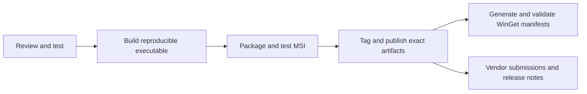

# Release checklist

[Documentation](README.md) · [Release hashes](RELEASES.md) · [Deployment](DEPLOYMENT.md)

Prepare releases from a reviewed commit in an isolated checkout. Test only
synthetic vaults, and do not publish debug/probe builds or private test artifacts.
Vordr has no automatic updater, so clear release notes and security advisories
are part of the release work.



## 1. Review and test

- [ ] Confirm the selected commit and version resource in `vordr.rc`.
- [ ] Review changes since the last release, including effects on published versions.
- [ ] Update user/reference docs and release notes.
- [ ] Run `tests\run_all.cmd` in a safe test environment. It stops Vordr processes
  and replaces build outputs; see [Development](DEVELOPMENT.md).
- [ ] Inspect every stage and skip. Do not treat “ALL STAGES PASSED” with missing
  Python, installer tooling, or desktop checks as complete release evidence.
- [ ] Exercise GUI unlock, edit/save/retry, lock, preview cleanup, import/export,
  backup restoration, and policy behavior with synthetic data.

## 2. Produce the executable

- [ ] Build with `build.cmd release strict`, with Python and the intended toolchain.
- [ ] Repeat in a second clean checkout of the same commit with the same toolchain.
- [ ] Compare executable hashes and investigate differences.
- [ ] Record the source commit, toolchain versions, build command, and SHA-256.
- [ ] Run `selftest` and the Python crypto verifier against the exact executable
  being published.
- [ ] Confirm no `dbg`, `probeio`, or `guishow` flags were used.

The gate's normal restored build is not the final reproducible release artifact.
Build the intended release explicitly before packaging it.

## 3. Package and test the MSI

The gate includes MSI creation and table/costing verification, but does not
perform a real installation. Repeat packaging against the exact final release
executable, not a stale or diagnostic `bin\vordr.exe`.

```powershell
powershell -NoProfile -ExecutionPolicy Bypass -File tools\make_msi.ps1
powershell -NoProfile -ExecutionPolicy Bypass -File tools\verify_msi.ps1 -Msi bin\vordr-X.Y.Z.msi
```

Replace `X.Y.Z` with the release version.

- [ ] Verify tables, policy components, 64-bit registry view, and upgrade range.
- [ ] In an isolated VM, install over the previous release and confirm exactly
  one Vordr entry remains in installed applications.
- [ ] Test same-version replacement if repackaging is part of the workflow.
- [ ] Repeat policy properties on upgrade; verify only requested settings are locked.
- [ ] Verify the shortcut and quoted `.vordr` association with a path containing spaces.
- [ ] Confirm the installed executable's hash matches the final release executable.
- [ ] Uninstall and verify vaults and HKCU user data remain.
- [ ] Record the MSI hash and ProductCode separately. Keep the UpgradeCode unchanged.

Use an elevated shell for silent per-machine installation. Administrative
extraction (`msiexec /a`) alone does not exercise installation or upgrade logic.

## 4. Tag and publish

- [ ] Create an annotated version tag pointing to the reviewed, built commit.
- [ ] Add its executable hash and commit to [RELEASES.md](RELEASES.md).
- [ ] Publish the exact tested executable and, if offered, the exact tested MSI.
- [ ] State supported Windows/CPU requirements and changes from the previous release.
- [ ] Label known affected/superseded versions without deleting or moving their tags.
- [ ] Download the published files and compare them with the tested bytes.

A tag permanently identifies a source state. Hash documentation can be added
after tagging, but must clearly describe the tagged build rather than the
documentation commit.

## 5. Submit the WinGet update

Generate manifests from the **published MSI bytes**, not a locally rebuilt MSI.
Rebuilding produces a new ProductCode and hash even with the same executable.

```powershell
powershell -NoProfile -ExecutionPolicy Bypass -File tools\make_winget.ps1 -Url https://github.com/xxtsxx/Vordr/releases/download/vX.Y.Z/vordr-X.Y.Z.msi -Msi bin\vordr-X.Y.Z.msi -ReleaseDate YYYY-MM-DD
winget validate --manifest bin\winget\X.Y.Z
```

Replace the version and date placeholders. Pass `-Msi` explicitly to avoid
accidentally selecting a different local package.

- [ ] Verify version, URL, SHA-256, ProductCode, and release date.
- [ ] Confirm all three files have the correct schema-reference comment:
  `version`, `installer`, and `defaultLocale`, matching `ManifestVersion`.
- [ ] Preserve CRLF endings in the submitted files.
- [ ] Run local validation and test the manifest in an isolated installation.
- [ ] Submit one version under `manifests/t/ThomasSmistad/Vordr/X.Y.Z/` in
  `microsoft/winget-pkgs`.
- [ ] Read reviewer comments and remote validation results. Local validation
  does not guarantee repository-policy validation.
- [ ] Record the PR link and wait for acceptance before claiming the version is
  available through the community source.

The 0.2.3 submission exposed a useful distinction: locally valid manifests can
still need repository-required schema-reference headers. Diagnose the actual
reviewer feedback before treating a generic Azure error as a service outage.

## 6. Vendor submissions

- [ ] Submit each new public executable and MSI to Microsoft's
  [file submission portal](https://www.microsoft.com/en-us/wdsi/filesubmission)
  and relevant vendors, using their current process.
- [ ] Include the exact hashes and any observed detection names.
- [ ] If using a public multi-engine service, upload only intended public release
  artifacts, never vaults or user data.
- [ ] Record dates and responses in [ANTIVIRUS.md](ANTIVIRUS.md) or release notes.
- [ ] Distinguish a submitted sample, an awaiting response, and an actual vendor
  determination. Do not promise clearance or a response time.

## 7. Security-relevant released defects

Follow [SECURITY.md](../SECURITY.md), including coordinated disclosure.

- [ ] Identify the affected and fixed versions.
- [ ] Publish a GitHub Security Advisory when a released defect exposes data,
  weakens encryption, or loses data, including maintainer-discovered defects.
- [ ] Request a CVE through the advisory when exploitation is available to
  someone other than the vault owner.
- [ ] Mark affected versions beside their hashes in [RELEASES.md](RELEASES.md).
- [ ] Ship a new release; retain the old tag and explain the upgrade path.

Package managers and enterprise inventories can help users discover updates or
advisories, but their coverage is not guaranteed. Do not imply that Vordr itself
notifies all installed users.
