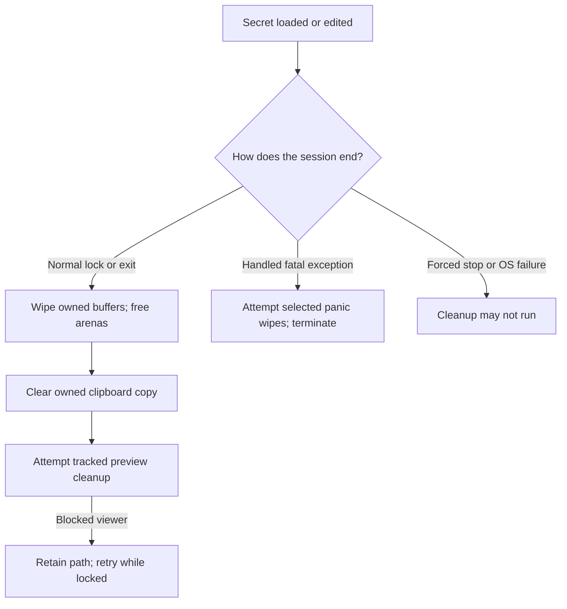

# Secret memory and plaintext exposure

[Documentation](README.md) · [Risk assessment](RISK_ASSESSMENT.md) · [Architecture](ARCHITECTURE.md) · [Assurance](ASSURANCE.md)

This is a source-oriented inventory for reviewing secret lifetimes. It covers
the named buffers and paths below; it is not an exhaustive proof that every
possible plaintext copy has been found. Re-check ownership, capacity, and cleanup
when modifying an allocation or context switch.

## What locking does

`sec_lock_statics` attempts to lock selected fixed buffers at startup.
`sec_ws_grow` adjusts the working-set reservation. A static lock failure is
recorded and shown as a warning; startup does not universally fail closed.

`secmem_alloc` allocates, locks, and registers a dynamic arena. It returns failure
rather than handing an unlocked arena to the caller. `secmem_free` wipes a
registered live allocation before releasing it.

Successful [VirtualLock](https://learn.microsoft.com/en-us/windows/win32/api/memoryapi/nf-memoryapi-virtuallock)
keeps the specified pages resident and out of ordinary paging while locked.
Do not extend that into a claim that all secrets are excluded from hibernation,
system dumps, kernel access, or every scratch allocation. The application does
not control all of those paths.

## Selected locked buffers

Names are in `src/`; the lock list is in `secmem.asm:sec_lock_statics`.

| Buffer | Module | Contents | Normal cleanup |
|---|---|---|---|
| `g_cfg_pass` (1025 B) | main | UTF-8 master password | GUI password-attempt cleanup and process exit |
| `g_vkey` (32 B) | vault | Active vault key | `vault_lock` |
| `g_xs_vkey` (32 B) | vault | Parked key during temporary context operations | Export/password-check context cleanup |
| `g_pwbuf`, `g_pw2buf` (2048 B each) | gui | Wide password and confirmation | Password conversion and create/unlock cleanup |
| `g_secret_w` (16384 B) | gui | Revealed/copied secret | Vault close/lock |
| `g_rowpw_w` (1024 B) | gui | Reveal overlay | `gui_colorpw_hide` and close/lock |
| `g_e_totp` (512 B), `g_totp_b32` (256 B) | gui | TOTP edit/selected key | Vault close/lock |
| `g_pwhist` | gui | Field-history records | History/entry teardown and lock |
| `g_pworig` | gui | Original values for history comparison | Entry/history teardown and lock |
| `g_pwhblob` | gui | Serialized history staging | History teardown and lock |
| Active vault body | vault via secmem | Decrypted records, including history and attachment references | `secmem_free` |
| Edit transaction bodies | gui via secmem | Original body and working copy | Success releases original; failure restores original and releases working copy |

History buffer sizes use `MAX_PWHIST`, `PWHIST_ENTRY`, `MAX_PWORIG`,
`PWORIG_STRIDE`, and `PWHBLOB_ENTRY`. Keep their allocation, lock, and wipe
sizes consistent rather than copying a stale byte count from documentation.

The edit transaction also has a history snapshot (`g_edit_history`), wiped on
either outcome. The panic path explicitly visits the original edit body and
history snapshot as well as the active body and selected fixed buffers.

## Other sensitive memory

Not every secret-bearing allocation is managed by `secmem_alloc`.

| Area | Exposure and cleanup to review |
|---|---|
| Argon2 arena (`g_arena`) | Large ordinary VirtualAlloc arena; not pinned; mixing state is wiped before release |
| Argon2 H0 staging (`g_hbuf`) | Sensitive pre-hash state, not in the fixed lock list; wiped on hash exit |
| `g_conv`, `g_convlabel` in vault | UTF-8 field/label scratch; wiped on vault lock, not locked by the named static list |
| `g_conv_w` in GUI | Wide display-conversion scratch; transient does not mean non-sensitive |
| `g_urlbuf`, `g_urlbuf2` | URLs may contain private hosts or tokens; wiped after the launch path |
| ZIP export buffers | Plaintext JSON, password copies, keys, and archive staging; normal cleanup in `ze_compose`/`ze_free` |
| Attachment staging/open buffers | Plaintext copies can use ordinary heap allocation; follow `attach_stage`, `attach_open`, and caller ownership |
| Windows controls and API buffers | Edit controls, clipboard, and provider buffers can hold copies beyond the named application arrays |

These are implementation limitations, not a claim that sensitive intermediate
values are harmless. Wiping a working buffer cannot erase a copy already made
by the OS, another process, storage snapshots, or a viewer.

## Normal and abnormal cleanup

`secmem_panic_wipe` avoids allocation and freeing because the heap may already
be damaged. It attempts to wipe known buffers before exception termination.
It does not guarantee that every crash reaches that handler or that every
sensitive temporary is included.

The live-base registry makes repeated frees of an unregistered address no-ops.
It does not provide generation-aware pointer identity: an address reused for a
new allocation must not be treated as safe through an old alias.

## Clipboard and previews

Clipboard exclusion formats request that cooperating Windows features avoid
history/cloud handling. They are not access control for the current clipboard.
The clear timer checks sequence ownership before clearing.

Preview files are created exclusively inside separate random temporary
directories. `gui_temp_purge` attempts overwrite, flush, deletion, and directory
removal. Failed cleanup stays tracked; the locked tray retries every five seconds.
Normal Exit asks the user to close blocked viewers. Forced termination or shutdown
can leave files behind, and overwrite/delete is not guaranteed physical erasure.

`NoPreview` disables the automatic preview hand-off. Downloads still write
plaintext wherever the user explicitly chooses. The viewer's own caches and
copies are outside Vordr's cleanup ownership.

## Comparison discipline

`ct_memcmp` in `hardening.asm` accumulates differences over the supplied length.
`gui_wstr_eq` accumulates content differences while scanning wide strings;
string lengths remain timing-visible. Neither description proves absence of
microarchitectural side channels.

| Use | Comparison path |
|---|---|
| Vault KCV, including TPM-recovered keys | `ct_memcmp` in vault open |
| GCM tag | `ct_memcmp` in `gcm_open` |
| Full-file MAC | `ct_memcmp` in vault authentication |
| ZIP password verifier and HMAC tag | `ct_memcmp` in `zi_decrypt` |
| Password and export confirmation | `gui_wstr_eq` |
| Old/new values for history capture | `gui_wstr_eq` |

Public format keywords, attachment-ID lookup, local display sorting, and test
sentinel scans have different comparison needs. Classify the data and any
observable oracle before assuming an early exit is harmless.

## Review checklist

- Identify every owner and copy, including temporary import/export contexts.
- Match wipe lengths to allocated capacities and actual initialized contents.
- Check success, cancellation, authentication failure, allocation failure,
  write failure, lock, and fatal-exception paths.
- Preserve the original model until a GUI save succeeds.
- Confirm plaintext downloads/previews are described accurately to users.
- Run relevant probes: `secscan`, `secfreedup`, `lktest`, `tmptest`,
  `layoutkat`, and the persistence harness.

A passing sentinel scan demonstrates the exercised path, not universal cleanup.
See [Assurance](ASSURANCE.md) for test limitations.
