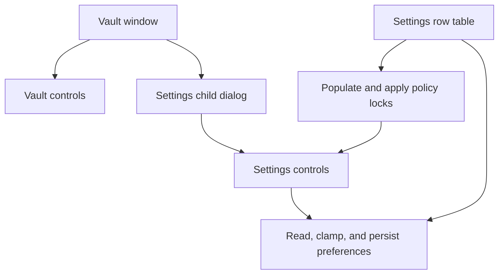

# Settings screen design

[Documentation](README.md) · [Policy reference](DEPLOYMENT.md)

Status: implemented. The child dialog and table-driven settings landed in July
2026. This page describes the resulting design and the reasons for it, rather
than the superseded proposal.

## One screen, one owner

Settings is a `DLG_SETTINGS` child dialog inside the vault window, addressed
through `g_settings_hwnd`. Showing or hiding that window replaces the old
approach of toggling separate arrays of controls owned by `DLG_VAULT`.

A settings control must be addressed through its owning dialog. Win32 calls can
fail silently when given the parent window instead: text writes disappear,
numeric reads return zero, and a missing control can yield a null handle.
Passing that null handle to `InvalidateRect` can repaint unrelated windows.

The earlier overlay used duplicated state (`g_menu_open` and `g_overlay`),
control-ID arrays, and painter-specific visibility rules. The child-dialog
refactor removed that duplication. `g_menu_open` still tracks settings state.

## Table-driven settings

`g_setrows` in `src/gui.asm` describes the controls mapped to DWORD settings:
control ID, kind, value global, registry name, policy-lock flag, clamp, and flags.

- `gui_settings_populate` initializes controls and applies HKLM policy locks.
- `gui_settings_store` reads, clamps, and persists unlocked rows.
- Each row has its own handling, so one locked or invalid value does not skip
  unrelated settings.
- TPM enrollment remains explicit: wrapping or forgetting a key is a side
  effect, not just writing a preference.

The idle timer is re-armed after settings are stored. A changed timeout must
take effect without requiring another unlock.

## Painting and layout

The child owns its coordinate space and can be resized as one window. That
does not eliminate all parent-painting concerns. The vault window does not
use `WS_CLIPCHILDREN`; its background erase can paint beneath the child during
resize. The field-card painting guard therefore remains.

Do not remove that guard merely because Settings has a separate HWND. Adding
`WS_CLIPCHILDREN` would affect every child and needs its own visual review.

Runtime-populated captions should start empty in the resource template.
A convincing placeholder can hide a failed write to the wrong dialog.

## Adding or changing a setting

1. Add the resource control to `DLG_SETTINGS`, with a unique ID.
2. Add the matching assembly constant and, where applicable, a `g_setrows` row.
3. Define the default, clamp, registry type, and HKLM lock behavior.
4. Keep actions such as TPM enrollment outside generic persistence loops.
5. Update the [deployment table](DEPLOYMENT.md#properties) and MSI property
   mapping if administrators should be able to install that policy.
6. Run `idcheck`, `dlgtarget`, `rccheck`, and a strict build.
7. Test populate/save, zero and out-of-range values, independent locked rows,
   resize, close, and locking while Settings is open.

## What the checks do not cover

`tools/dlgtarget.py` checks known window targets and settings-table ownership.
It does not fully infer arbitrary local HWND expressions. Moving IDs into a
table once reduced its call coverage sharply; explicit table checks were needed
to restore useful coverage.

A clean static check or geometry probe does not establish correct colors,
readable captions, focus, or flicker-free repainting. Those still need on-screen
verification.
