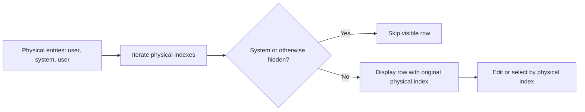

# System items: encrypted vault metadata

[Documentation](README.md) · [Format reference](formats.md)

Status: implemented. System items store per-vault metadata in the encrypted
record body. The initial use is the master-password reminder timestamp.
This page replaces the old proposal and its already-resolved decision list.

## Representation

A system item is an ordinary entry whose **first field** has kind `VF_SYSTEM`.
It uses the same body encryption, validation, and serialization as user entries.

| Field | Tag | Value |
|---|---|---|
| `VF_SYSTEM` | 17 | One-byte schema version, currently 1; must be first |
| `VF_SYS_PWVERIFY` | 18 | Last master-password verification time as u64 FILETIME |
| Retired grace-period field | 19 | Reserved; do not reuse |

Unknown system fields must survive save/reload. Do not treat tag 19 as free:
an earlier reminder design used it, and old files can contain it.

This additive record encoding did not require another container-version bump.
The current reader still enforces the container version separately.

## Physical indexes are the invariant

`vault_count` is the number of physical entries, including system items.
`vault_user_count` is a filtered count for presentation. List item data and
selection masks continue to carry **physical indexes**.

Do not replace a physical loop bound with the user count. That can skip a real
entry after a hidden one or direct an edit to the wrong record.

Important helpers in `src/vault.asm`:

| Helper | Purpose |
|---|---|
| `vault_is_system` | Check an entry in the active vault |
| `vault_user_count` | Count entries excluding system items |
| `vault_sys_find` | Locate the system item |
| `vault_last_user` | Find the last non-system entry instead of assuming count minus one |
| `sys_first_kind` | Inspect an entry pointer, including one from a foreign body |
| `vault_pwverify_set` | Store the reminder timestamp, creating metadata when needed |
| `vault_pw_due` | Query whether the reminder is due |

## Creation and preservation

The real GUI creation path adds a system item after the initial vault is opened.
Low-level `do_init` and `do_seed` remain system-item-free so their diagnostic
record counts retain their meaning.

An existing vault is not rewritten merely because it lacks a system item.
The item is created when a timestamp needs to be stored. It may therefore be
last rather than first in the physical entry list.

Do not introduce a separate metadata trailer for the same timestamp. The system
item is the implemented mechanism; the earlier alternate trailer proposal was
superseded.

## Filtering at each boundary

- GUI lists, export selection, and health totals exclude system entries.
- Selection arrays remain sized by the physical count.
- Native and ZIP exports exclude source system metadata.
- Native import/merge excludes foreign system items.
- Foreign-body walks use pointer-based checks, not an active-vault index helper.

The foreign-body distinction matters: `vault_is_system` checks the live
`g_body_ptr`, not whichever snapshot a caller happens to be traversing.
Importing another system item could shadow the local timestamp; exporting it
could incorrectly inherit the source vault's reminder history.

The internal `fed_export` and `fed_merge` names are historical implementation
names. They do not imply a current multi-vault federation product feature.

## Password reminder behavior

`PwVerifyDays` defaults to 30; zero disables the reminder. HKLM can enforce the
setting. The reminder is intended to help users remember a password they rarely
type when TPM unlock is available.

It is not a mandatory second factor or an escalating lockout policy.
Postponement does not intentionally delete TPM enrollment. A test-only
`PwVerifyNow` switch is not available in a normal release.

## Regression expectations

`sysitemkat` and `c9kat` exercise metadata and reminder behavior. Export and
import probes cover filtering and context restoration. When modifying this code,
check that:

1. User counts exclude system items while physical indexes remain stable.
2. Known and unknown metadata survives save/reload.
3. A system item at the end does not become the selected “last user entry.”
4. Export excludes source metadata even if a selection mask includes it.
5. Import skips foreign metadata with a different entry ID, so ordinary ID
   deduplication cannot conceal a missing system filter.
6. No read-only open silently migrates or rewrites the file.
